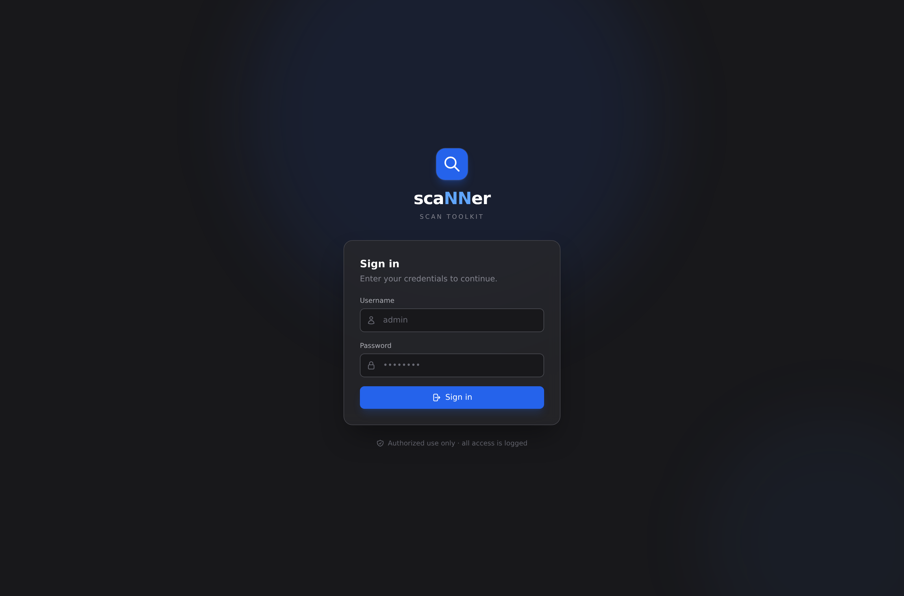
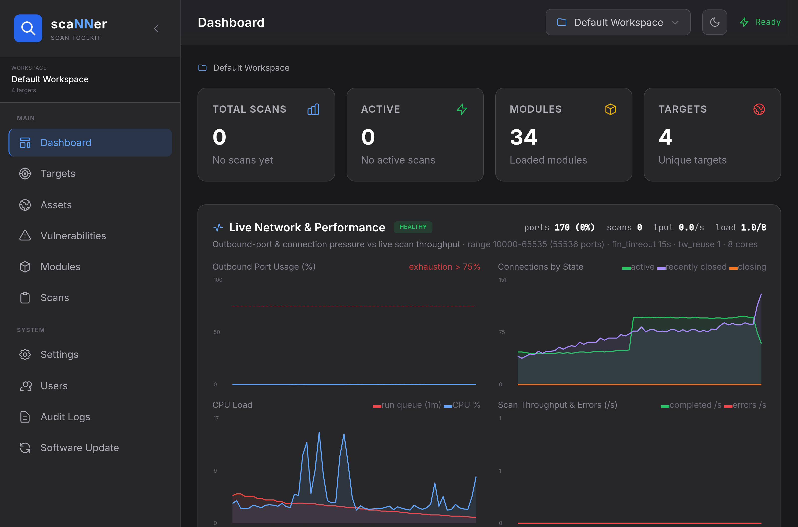
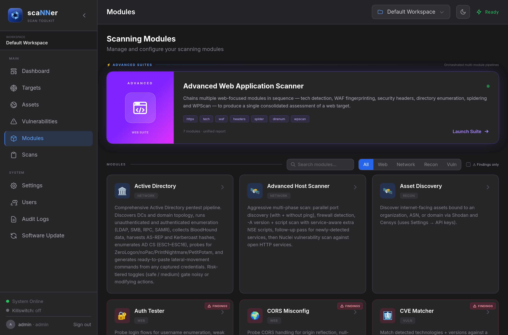
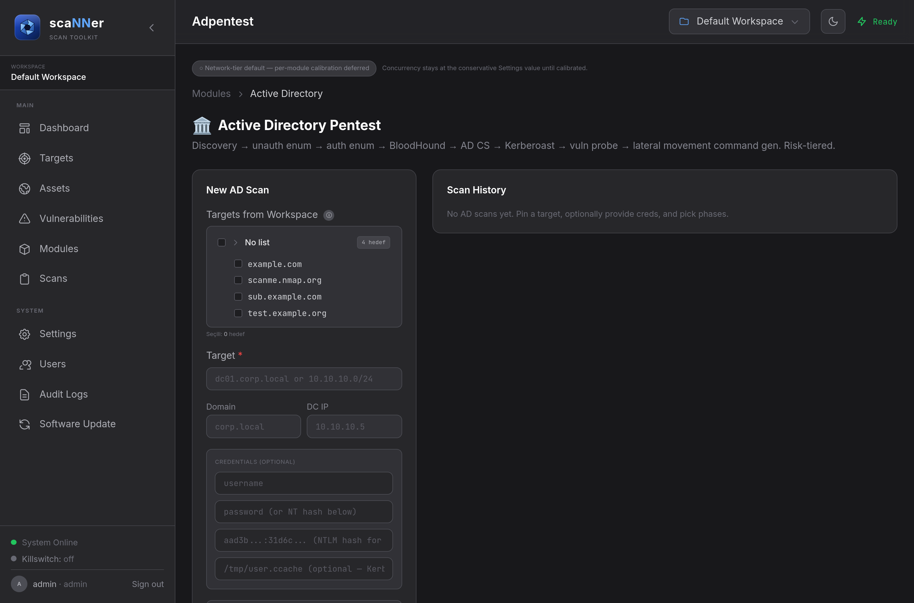
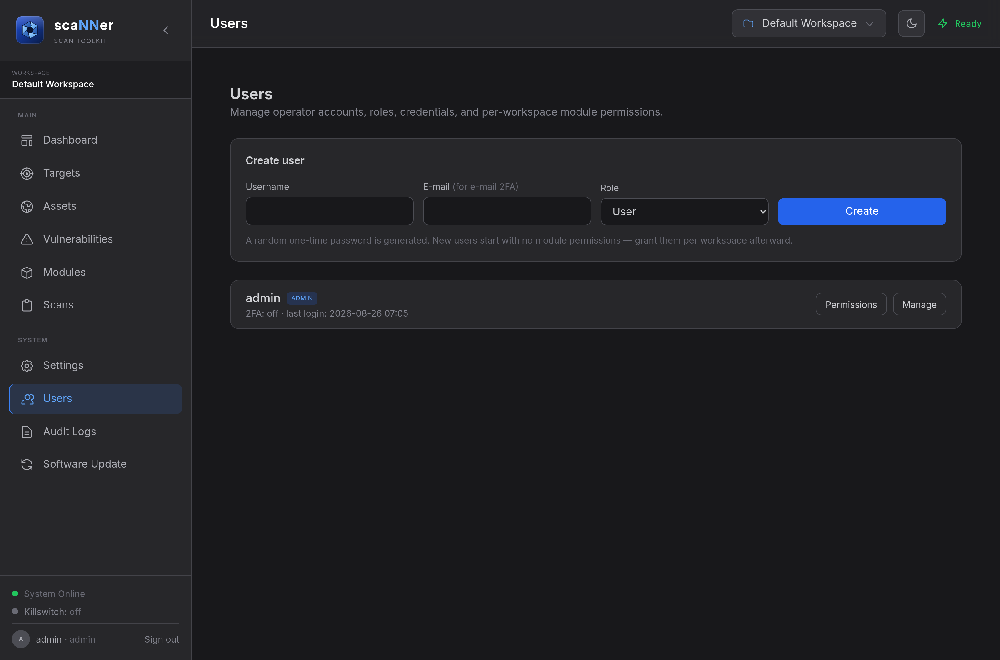
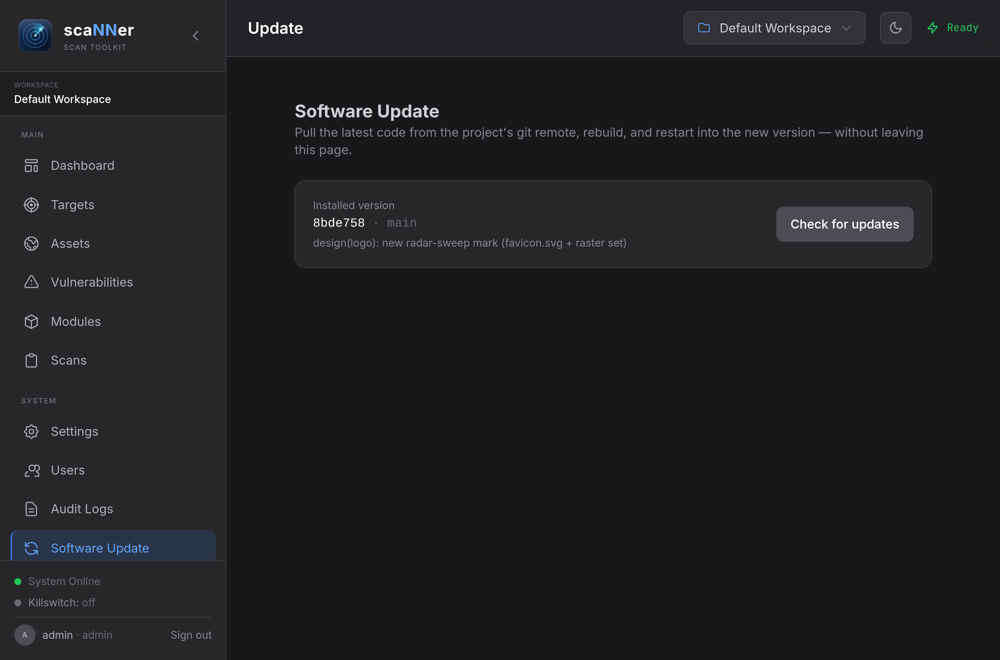

# scaNNer

A single-binary, web-UI penetration-testing **scan orchestrator**. One Go binary
serves a Tailwind/htmx frontend on port **9090** and drives ~33 internal modules
that wrap standard offensive tooling (nmap, nuclei, wpscan, hydra, the impacket
suite, netexec/nxc, subfinder, amass, whatweb, and more), parsing their output
into structured findings stored in SQLite. Every scan is asynchronous,
cancellable, and re-runnable from its saved configuration.

> **Maturity / expectations.** This is a personal toolkit shared as-is. The
> modules vary a lot in maturity — some are well-exercised, others are
> experimental and can produce incomplete output or false positives. Treat
> results as **leads to verify**, not conclusions, and expect rough edges. It is
> not a polished commercial scanner and makes no claim to be one.

> **Authorized use only.** This is offensive security tooling intended for
> systems you own or are explicitly permitted to test (pentest engagements,
> CTFs, research labs). You are responsible for having written authorization
> before scanning any target and for complying with all applicable laws.

## Screenshots

| Login | Dashboard |
|---|---|
|  |  |

| Modules | Module launch form |
|---|---|
|  |  |

| Users & permissions | Software update |
|---|---|
|  |  |

## Features

- **~33 modules** across recon, web, network, and vuln categories, plus an
  orchestrated multi-stage **Advanced Web** suite.
- **Multi-user auth & RBAC** — login sessions, an admin-managed
  per-user × per-workspace × per-module permission model, an optional per-user
  **allowed-domain scope**, and an append-only audit log of access + scan activity.
- **Two-factor auth** — TOTP (authenticator app) or e-mail codes, enabled
  per user by an admin; brute-force lockouts on both password and 2FA.
- **Built-in HTTPS** with an auto-generated self-signed certificate.
- **Network killswitch** — all outbound scan traffic can be confined to a Linux
  network namespace bound to a chosen interface, so a VPN drop kills the scan
  instead of leaking via the default route.
- **In-app software update** — pull the latest code from git, rebuild, and
  restart into the new version from the UI (build-to-temp + smoke-test +
  atomic swap + rollback, so a bad update can't brick the app).
- **Workspaces**, target lists, an assets inventory, a live network/performance
  dashboard, a CVE matcher, and CSV/JSON/PDF report export.

## Modules

Grouped by category. Depth and reliability differ per module — see the maturity
note above.

### Recon
| Module | What it does |
|---|---|
| DNS Enumerator | Subdomain enumeration + DNS records (subfinder/amass/puredns/dig). |
| HTTPX Finder | Probes hosts/ports for live HTTP(S) services and metadata. |
| Tech Detector | Fingerprints web technologies (whatweb). |
| WAF Detector | Detects web application firewalls in front of a target. |
| WHOIS / ASN Lookup | WHOIS and ASN/owner information for hosts and ranges. |
| Asset Discovery | Aggregates discovered hosts/services into workspace assets. |
| Subdomain Takeover | Checks subdomains for dangling/claimable records. |
| Email Harvester | Collects e-mail addresses for a domain (theHarvester). |
| GitHub Leak Scanner | Searches public GitHub for exposed secrets/references. |
| OOB Collaborator | A local out-of-band interaction listener for blind findings. |

### Web
| Module | What it does |
|---|---|
| Advanced Web Application Scanner | Orchestrated suite chaining several web modules into one run. |
| Nuclei | Template-based vulnerability scanning (nuclei). |
| WPScan | WordPress enumeration and checks (wpscan). |
| Directory Enumerator | Content/directory brute-forcing. |
| Web Spider | Crawls a site to map its surface. |
| Parameter Discovery | Finds hidden request parameters. |
| Security Headers | Reviews HTTP security headers. |
| HTTP Method Tester | Probes allowed/unsafe HTTP methods. |
| CORS Misconfig | Checks for cross-origin misconfigurations. |
| Open Redirect | Tests for open-redirect issues. |
| SSTI Probe | Server-side template injection probing. |
| Cache & Smuggle | Cache-poisoning / request-smuggling probes. |
| GraphQL Scanner | GraphQL introspection and checks. |
| JWT Analyzer | Inspects and tests JSON Web Tokens. |
| Auth Tester | Authentication-flow weakness checks. |
| Concurrency Tester | Race-condition / concurrency testing. |

### Network
| Module | What it does |
|---|---|
| Host Discovery | Live-host discovery across ranges (nmap). |
| Advanced Host Scanner | Port + service/version scanning (nmap). |
| SSL/TLS Scanner | TLS configuration and weakness review (sslscan/nmap/openssl). |
| SMB Enum | SMB share/user enumeration (smbclient/enum4linux-ng). |
| SNMP Enum | SNMP enumeration (onesixtyone/snmpwalk). |
| Service Brute Forcer | Credential brute-forcing for SSH/FTP/RDP (hydra). |
| Active Directory | Multi-phase AD assessment (impacket/nxc/bloodhound/certipy/…). |

### Vuln
| Module | What it does |
|---|---|
| CVE Matcher | Matches detected products/versions against a local CVE database. |

## Quick start

Get the code:

```bash
git clone https://github.com/himfatihoner/scaNNer.git
cd scaNNer
```

### Install as a service (Linux) — recommended

One command does it all — checks prerequisites, builds the binary, and
provisions the service:

```bash
sudo scripts/install.sh          # add --yes to run non-interactively
```

It sets scaNNer up as a systemd service with the capabilities the network
killswitch needs, tunes the host's ephemeral-port range for heavy scans, and
installs a passwordless service-control sudoers drop-in.

Before touching the system it runs a **prerequisite preflight**: it checks the
Go toolchain, git, and every external scan tool, reports what's present vs
missing, and offers to auto-install the apt-packaged ones (`go install`/pipx
tools are shown as copy-paste steps). It then **builds the binary** for you (as
your user, so it stays user-owned). If any step fails it rolls back every change
and explains why. See [scripts/README.md](scripts/README.md).

### Updating — one button, no terminal

After the one-time install, update from **Software Update** in the UI: it pulls
the latest code, rebuilds, and restarts into the new version in place — no
`git`/`go`/`sudo` and no terminal. The re-exec inherits the service's
capabilities, so the killswitch keeps working across updates.

If an update also changes **system integration** (the systemd unit,
capabilities, sudoers, tmpfiles, sysctl, or new tools — i.e. `scripts/install.sh`
changed), the page detects it and asks for your **sudo password once** to re-run
the installer. That password is used for that single action and is **never
stored, logged, or written anywhere** — it is piped straight to `sudo` over the
HTTPS connection (the prompt is refused over plain HTTP) and wiped from memory
immediately. The installer runs in its own transient systemd unit so it survives
the restart it performs.

To remove the service and every system change it made (your repo, binary, and
data are left untouched):

```bash
sudo scripts/uninstall.sh
```

Then open **`https://<host>:9090`** — `localhost` when you run it on your own
machine, or the server's IP/hostname when it runs on a remote box. The
certificate is self-signed, so your browser will warn on first visit; that's
expected. On first launch an initial **admin** account is created and its
randomly generated password is printed **once** to the log
(`sudo journalctl -u scanner | grep -A6 'INITIAL ADMIN'`) — save it; you'll be
required to change it at first login.

### Build & run (no Docker)

For development, skip the service and run the binary directly from the cloned
repo:

```bash
go build -o ./scanner ./cmd/scanner
./scanner
```

Override defaults with environment variables:

```bash
PORT=8080 DATA_DIR=/var/lib/scanner ./scanner   # port + state directory
SCANNER_TLS=0 ./scanner                          # plain HTTP (trusted network only)
```

> Reachable beyond your own machine? Put it behind your own reverse-proxy TLS,
> or keep the built-in self-signed HTTPS — don't serve it over plain HTTP on an
> untrusted network.

### Docker

```bash
docker compose up -d --build     # Kali-based image; first build takes several minutes
docker compose logs -f           # watch logs (the initial admin password prints here)
```

State (the SQLite database) persists in a named volume, so restarts keep scan
history. (In-app updates are disabled inside the container image, which has no
git checkout — rebuild the image to update.)

## External tools

Modules shell out to third-party tools expected on `$PATH` (nmap, nuclei,
wpscan, hydra, the impacket suite, netexec/nxc, subfinder, amass,
puredns/massdns, whatweb, and others). The Docker image installs/builds the
common ones; for a bare-metal run, `scripts/install.sh` checks for them and can
install the missing ones for you. Anything still absent is reported in the
startup banner and the affected modules degrade gracefully.

## Security model (at a glance)

- Passwords are hashed with bcrypt; session tokens are random and stored only as
  a hash server-side (the raw token lives solely in an `HttpOnly` cookie).
- Every request passes an authentication + authorization gate before reaching any
  handler; users never see or run modules they lack a grant for, and a scoped
  user can only scan domains an admin allowed them.
- The audit log is append-only with no in-app deletion path (it survives scan
  deletion). It is not tamper-proof against direct database-file access — treat
  the database file as sensitive.
- Run behind your own reverse-proxy TLS, or use the built-in self-signed HTTPS,
  whenever the UI is reachable beyond localhost.

## Tech stack

Go (single binary) · `modernc.org/sqlite` (pure-Go, no CGO) + `sqlx` ·
Tailwind + htmx (self-hosted, no CDN) · `net/http`.

## License

**PolyForm Noncommercial License 1.0.0** — see [LICENSE](LICENSE).

Free for any **noncommercial** purpose: personal use, study, research, hobby
projects, and use by nonprofits, educational institutions, and government or
public-safety organizations. **Commercial use is not permitted.** It is a
source-available license, not an OSI open-source one.
